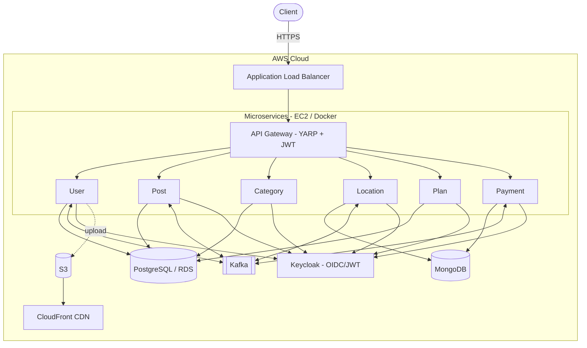

<div align="center">

# 🌺 AlohaMarket

### Cloud-Native Marketplace Platform

A marketplace backend built with a **.NET Aspire microservices** architecture and deployed to **AWS** using **Terraform (IaC)**, **Docker**, and **AWS CodeBuild**.


</div>

---

## 📖 Overview

AlohaMarket is a classified-ads / marketplace backend composed of **7 independently deployable services** (an API Gateway + 6 microservices) covering users, posts, categories, locations, subscription plans, and payments. Services communicate asynchronously through **Apache Kafka**, are secured with **Keycloak (OIDC/JWT)** behind a **YARP** API Gateway, and are orchestrated locally with **.NET Aspire**.

The entire platform is provisioned and deployed to **AWS** using **Terraform**, with container images built by **AWS CodeBuild** and pushed to **ECR**.

## 🏗️ Architecture



## 🧩 Services

| Service | Responsibility | Data Store |
|---|---|---|
| **API Gateway** | Routing, JWT auth, request forwarding (YARP) | — |
| **User** | User profiles & avatars | PostgreSQL |
| **Post** | Listings / posts | PostgreSQL |
| **Category** | Product categories | PostgreSQL |
| **Location** | Provinces / locations | MongoDB |
| **Plan** | Subscription plans | PostgreSQL |
| **Payment** | Payments (VNPay) | MongoDB |

## 🛠️ Tech Stack

| Layer | Technologies |
|---|---|
| **Backend** | .NET 9, ASP.NET Core, .NET Aspire, YARP, MediatR, EF Core |
| **Data & Messaging** | PostgreSQL, MongoDB, Apache Kafka |
| **Auth** | Keycloak (OpenID Connect / JWT) |
| **Media** | Amazon S3 + CloudFront |
| **Cloud / DevOps** | AWS (VPC, EC2 Auto Scaling, ALB, RDS, ECR, Secrets Manager, CloudWatch, IAM), Terraform, Docker, AWS CodeBuild |

## ☁️ Cloud & Deployment

- **Infrastructure as Code** — the full AWS environment (VPC across 2 AZs, EC2 Auto Scaling, ALB, RDS, S3 + CloudFront, ECR, Secrets Manager, CloudWatch, IAM) is defined with **modular Terraform**.
- **Containerization** — every service ships as a **Docker** image.
- **CI / build** — **AWS CodeBuild** builds and pushes images to **ECR**; EC2 instances pull and run them via `docker-compose` bootstrapped from launch-template user data.
- **Configuration & secrets** — loaded at runtime from **AWS Secrets Manager**.
- **Cost-aware design** — toggles switch between a **free-tier / cost-optimized** setup (self-hosted Kafka, MongoDB & Keycloak on EC2) and a **high-availability** setup (Amazon MSK, DocumentDB, Multi-AZ RDS).

> ℹ️ Infrastructure code and environment-specific secrets are managed in a separate, private location and are intentionally excluded from this repository.

## 🚀 Getting Started (Local)

**Prerequisites:** [.NET 9 SDK](https://dotnet.microsoft.com/download), [Docker Desktop](https://www.docker.com/products/docker-desktop/)

```bash
# Clone
git clone https://github.com/leluc212/Aloha_Market.git
cd Aloha_Market

# Run the whole system with .NET Aspire
dotnet run --project Aloha/Aloha.AppHost
```

The Aspire dashboard will start the services and their dependencies (Kafka, etc.). Each service also exposes Swagger UI in Development.

> Copy `appsettings.json` for each service from the provided templates and fill in your own connection strings / Keycloak settings.

## 📂 Project Structure

```
AlohaMarket/
├── Aloha/
│   ├── Aloha.AppHost/           # .NET Aspire orchestrator
│   └── Aloha.ServiceDefaults/   # Shared: auth, storage, health, telemetry
├── Aloha.ApiGateway/            # YARP gateway + JWT
├── Aloha.UserService/
├── Aloha.MicroService.Post/
├── Aloha.CategoryService/
├── Aloha.LocationService/
├── Aloha.MicroService.Plan/
├── Aloha.MicroService.Payment/
└── Aloha.EventBus*/             # Kafka event bus abstractions
```

---

<div align="center">
Built with ❤️ using .NET Aspire & AWS
</div>
